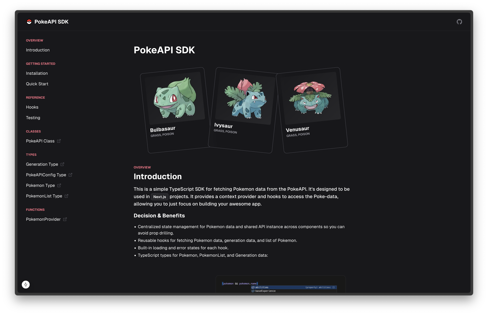

# PokeAPI SDK

This is a simple TypeScript SDK for fetching Pokemon data from the PokeAPI. It's designed to be used in Next.js projects and provides a context provider and hooks to access the Poke-data, allowing you to just focus on building your awesome app.



#### For richer docs experience, clone the repository and run the docs-site locally.

Install the dependencies:

```bash
npm install
```

Build the SDK:

```bash
cd packages/pokeapi-sdk
npm run build
```

Run the docs-site (at the root of the repository):

```bash
npm run dev
```

## PokeAPI SDK Readme

I suggest checking out the richer docs experience above...but you can always access the full SDK's documentation [here](./packages/pokeapi-sdk/README.md).
